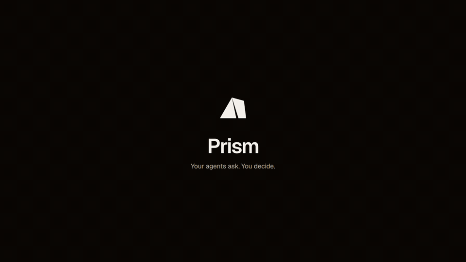

# Prism

**A local MCP gateway that lives in your system tray.** Point Claude Code, Cursor, Codex or any MCP client at one endpoint. Prism runs your MCP servers, aggregates their tools, and holds any call your rules mark as *ask* until you allow or deny it from the panel. Nothing leaves the machine.

<p align="center">
  
</p>

<p align="center">
  <a href="https://github.com/1broseidon/prism/releases/latest"></a>
  <a href="https://github.com/1broseidon/prism/actions/workflows/ci.yml"></a>
  <a href="LICENSE"></a>
</p>

- **One endpoint.** Every agent connects to `http://127.0.0.1:9086/mcp`. Prism spawns your real MCP servers over stdio and exposes their tools as `{server}__{tool}`.
- **Held calls.** A call that needs you shows up as a card with a two-minute countdown. Allow once, allow for 30 minutes, always allow this tool, or allow everything on that server. Denial is a first-class answer with a clear refusal to the agent.
- **Approval is consent.** Prism is its own OAuth 2.1 authorization server. A new agent registers, a browser parks on the consent step, and the approve card in the panel is that consent. Clients without OAuth get a manual bearer token.
- **Secrets stay in the keychain.** Server arguments and environment go into the OS credential store, never into a config file. The audit log is redacted and rotated.

## Install

Download the build for your machine from the [latest release](https://github.com/1broseidon/prism/releases/latest). Every asset has a line in `checksums.txt`.

| Platform | Asset | Notes |
| --- | --- | --- |
| macOS, Apple silicon | `prism_<version>_darwin_arm64.dmg` | Drag Prism to Applications. |
| macOS, Intel | `prism_<version>_darwin_x86_64.dmg` | Same. |
| Windows | `prism_<version>_windows_x86_64.msi` or `-setup.exe` | MSI for managed machines, the setup exe for a per-user install. |
| Linux, x86_64 | `.AppImage`, `.deb`, `.rpm` | AppImage needs `chmod +x`. The deb and rpm declare their WebKitGTK and AppIndicator dependencies. |
| Linux, arm64 | `.AppImage`, `.deb`, `.rpm` | Same. |

**macOS quarantine.** Builds are ad-hoc signed, not notarized. The first launch is refused with "cannot be opened because the developer cannot be verified", and on some versions with "is damaged and can't be opened". Either way, clear the quarantine flag once after copying the app to Applications:

```sh
xattr -dr com.apple.quarantine /Applications/Prism.app
```

**Linux requirements.** Prism needs a session D-Bus and an unlocked Secret Service provider such as GNOME Keyring or KWallet, because that is where server credentials live. GNOME users also need an AppIndicator extension for the tray icon to appear. Ubuntu and Fedora desktops ship both.

A Homebrew cask via `1broseidon/tap` follows the first tagged release.

### From source

Requires Rust stable, Node 24 and pnpm 10. On Linux, also the Tauri build dependencies:

```sh
sudo apt-get install -y libwebkit2gtk-4.1-dev libayatana-appindicator3-dev librsvg2-dev \
  libdbus-1-dev libssl-dev libxdo-dev pkg-config build-essential
```

Then:

```sh
cd apps/desktop
pnpm install
pnpm tauri build          # bundles land in target/release/bundle
```

## First run

Prism starts in the tray and stays there. Click the icon on macOS and Windows, or pick **Open Prism** from the menu on Linux. `Ctrl+Shift+Space` (`Cmd+Shift+Space` on macOS) toggles the panel from anywhere.

The gateway listens on `127.0.0.1:9086`. Change it with `listen_port` in `prism.json`, which is written on first launch:

| OS | Configuration | Audit log |
| --- | --- | --- |
| Linux | `~/.config/dev.prism.gateway/prism.json` | `~/.local/share/dev.prism.gateway/audit.jsonl` |
| macOS | `~/Library/Application Support/dev.prism.gateway/prism.json` | `~/Library/Application Support/dev.prism.gateway/audit.jsonl` |
| Windows | `%APPDATA%\dev.prism.gateway\prism.json` | `%APPDATA%\dev.prism.gateway\audit.jsonl` |

Linux honours `XDG_CONFIG_HOME` and `XDG_DATA_HOME`. Directories are `0700` and files `0600` on Unix; Windows gets a DACL limited to you and SYSTEM. Configuration writes are atomic, so a crash mid-save cannot truncate the live file.

The panel has four tabs. **Now** holds anything waiting for you plus the recent feed. **Servers**, **Agents** and **Rules** are the three things you configure. The sliders icon opens operator settings.

## Add a server

**Servers → Add server.** Give it a name, the executable, its arguments, and any environment variables. Prism does not install servers; it launches whatever executable you name, wherever your package manager put it.

Arguments and environment values go straight into the OS credential store: macOS Keychain, Windows Credential Manager, or Secret Service on Linux. Prism protects *all* of them rather than guessing which ones are secrets, since tokens have a way of ending up in URLs and positional arguments. `prism.json` keeps only the name, executable, enabled flag and an opaque credential reference. Copying `prism.json` to another machine does not copy credentials; add the servers again there.

Servers receive a small environment allowlist (PATH, HOME, locale, temp and XDG directories, the platform's display and profile variables) plus what you configured. Your shell's other tokens are not inherited. Server stderr is discarded so a chatty server cannot echo a credential into a log.

If the credential store is locked when Prism starts, affected servers show as failed and the panel stays usable. Unlock the store and restart the server.

## Connect an agent

**Agents → Connect an agent** shows both options with copy buttons.

**Clients with OAuth support** (Claude Code, Cursor, Codex and most current MCP clients) only need the URL:

```json
{ "mcpServers": { "prism": { "url": "http://127.0.0.1:9086/mcp" } } }
```

The client registers itself, opens a browser, and the browser waits. Prism flips the tray amber and shows a **wants to connect** card. Approve, and the client gets a one-hour access token and a thirty-day rotating refresh token; the browser is sent back and the tools appear. Deny, and no token is ever issued.

Later sign-ins for an approved agent also ask, as a **wants to sign in again** card. A public client id proves nothing, so if nothing on your side asked to sign in, refuse it. Refusing leaves the agent's existing approval and tokens alone.

**Clients without OAuth support** get a manual token: **Connect an agent → Manual token**, name the agent, and copy the token or the generated settings into the client. It must send `Authorization: Bearer <token>`. There is one manual token per agent, shown only once, with no expiry. **Replace token** rotates it without touching permissions; **Revoke token** or **Revoke access** kill it immediately, including on open sessions.

Identity is the token, never the name a client announces about itself. Every session is bound to the identity that opened it, so one agent's token cannot ride another agent's session.

## Decide what runs

Three things are independent for every call: the **decision**, how loudly Prism **tells you**, and how long the answer **lasts**.

Each agent has a **posture**, the default when no rule matches:

| Posture | Behaviour |
| --- | --- |
| Supervised | Every call asks. |
| First use (default) | Asks once per tool, then remembers your answer. |
| Guided | Tools the server annotates as read-only pass; everything else asks. Trusts the server's own annotations. |
| Trusted | Everything passes and is logged. |

Each agent also has an **attention** level for calls that resolve without asking: silent, badge (tray lights until you open the panel), notify, or open the panel.

**Rules** sit on top of the posture. A rule matches an agent, a server and a tool (exact name or a glob such as `create_*`), decides allow, deny or ask, and can carry its own attention level and a time box. The most specific rule wins; deny beats ask beats allow on a tie; an exact name beats a glob. Expired time boxes prune themselves.

Every answer you give from a held-call card becomes one of these: allow once resolves the call, the other three write a rule. Tap an agent to see its posture, per-server access (All / Ask / None), per-tool overrides, and every remembered grant with its countdown.

**Operator settings**, behind the sliders icon:

- **Do not disturb.** Held calls resolve on their own; new agents still ask.
- **When nobody answers.** Deny, or allow if the tool is read-only.
- **Hold timeout.** How long a call waits for you. Default two minutes.
- **Rate tripwire.** When an agent runs hot, its allowed calls turn into asks until it calms down.

## What the audit log keeps

Agent, tool, timestamp, verdict and what decided it (you, a rule, the posture, do-not-disturb, or a timeout). Tool arguments and results are never persisted, and raw error text is dropped because servers echo credentials. The current file is capped at 5 MiB with three archives, and entries older than 30 days are removed at startup and hourly. The panel shows the last 1,000.

## What Prism protects, and what it does not

Everything binds to loopback. Every request must carry a loopback `Host`, and MCP and OAuth POSTs reject foreign or `null` browser origins, so a web page cannot drive the gateway from a tab. Registration is open to anything on the machine but grants nothing on its own. Pending sign-ins are limited (one per agent, sixteen overall, ten-minute expiry), request bodies are capped, and the OAuth routes are rate limited with `429` and `Retry-After`.

Prism does not sandbox the servers it launches. A server necessarily receives its own credentials, and any process running as your user can read what your user can read. The boundary Prism draws is between *agents* and *tools*: which agent may call what, when, and with your say-so.

## Troubleshooting

- **Port already in use.** Set `listen_port` in `prism.json` and restart. Update the URL in your clients.
- **No tray icon on GNOME.** Install an AppIndicator extension, then log out and back in.
- **Servers show "failed" on Linux at login.** The keyring was still locked when Prism started. Unlock it and restart the server from the Servers tab.
- **The agent sees no tools.** It is pending. Open the panel and approve it; Prism pushes a `tools/list_changed` notification so the client refetches.
- **The panel opens in the wrong corner on Linux.** Set `panel_anchor` in `prism.json` to `top-right`, `top-left`, `bottom-right` or `bottom-left`. `auto` follows the cursor from the tray menu.

## Development

```sh
cd apps/desktop
pnpm install
cargo tauri dev           # full app with the tray
pnpm dev                  # panel only, in a browser, against a fixture backend
```

The browser mode serves http://localhost:1420 with `src/mock.ts` as the backend. `#servers`, `#agents` and `#rules` pick a tab; `?scheme=light` or `?scheme=dark` overrides the colour scheme. `PRISM_SHOW_PANEL=1` opens the panel on launch of the real app.

```sh
cargo test -p prism-core                                   # gateway, policy, OAuth, storage
cargo test -p prism-core native_store_round_trip -- --ignored   # real keychain smoke test
```

- `crates/prism-core` is the headless gateway: policy, backends, approvals, OAuth, audit, storage.
- `apps/desktop` is the Tauri v2 tray app. Preact and Vite on the panel side, a thin Rust host on the other. `src/tokens.css` is the design system; every colour in `src/styles.css` goes through it.
- `docs/intro.html` is the animated walkthrough at the top of this page, self-contained.

## Releasing

Versions live in three places and must agree: the workspace `Cargo.toml`, `apps/desktop/src-tauri/tauri.conf.json` and `apps/desktop/package.json`. Bump them, add a `## [x.y.z]` section to `CHANGELOG.md`, commit, then tag:

```sh
git tag vX.Y.Z && git push --tags
```

The release workflow checks the three versions against the tag, builds the DMG, MSI, NSIS installer, AppImage, deb and rpm for five targets, writes `checksums.txt`, and publishes a GitHub release with the changelog section as its notes. Add the `APPLE_*` signing secrets to the repository to get notarized macOS builds; without them the bundle is ad-hoc signed.

## License

[MIT](LICENSE)
