# Prism

**A local MCP gateway that lives in your system tray.** Point Claude Code, Cursor, Codex or any MCP client at one endpoint. Prism runs your MCP servers, aggregates their tools, and holds any call your rules mark as *ask* until you allow or deny it from the panel. Policies and audit history stay on this machine; requests to remote MCP servers go to the URLs you configure.

<p align="center">
  
</p>

<p align="center">
  <a href="https://github.com/1broseidon/prism/releases/latest"></a>
  <a href="https://github.com/1broseidon/prism/actions/workflows/ci.yml"></a>
  <a href="LICENSE"></a>
</p>

- **One endpoint.** Every agent connects to `http://127.0.0.1:9086/mcp`. Prism runs your MCP servers over stdio or connects to them over HTTP, and exposes their tools as `{server}__{tool}`.
- **Held calls.** A call that needs you shows up as a card with a two-minute countdown. Allow once, allow for 30 minutes, always allow this tool, or allow everything on that server. Denial is a first-class answer with a clear refusal to the agent.
- **Approval is consent.** Prism is its own OAuth 2.1 authorization server. A new agent registers, a browser parks on the consent step, and the approve card in the panel is that consent. Clients without OAuth get a manual bearer token.
- **Secrets stay in the keychain.** Server arguments and environment go into the OS credential store, never into a config file. The audit log is redacted and rotated.

## Install

Download the build for your machine from the [latest release](https://github.com/1broseidon/prism/releases/latest). Every asset has a line in `checksums.txt`.

| Platform | Asset | Notes |
| --- | --- | --- |
| macOS, Apple silicon | `prism_<version>_darwin_arm64.dmg` | Drag Prism to Applications. |
| macOS, Intel | `prism_<version>_darwin_x86_64.dmg` | Same. |
| Windows | `prism_<version>_windows_x86_64.msi` or `-setup.exe` | MSI for managed machines, the setup exe for a per-user install. |
| Linux, x86_64 | `.AppImage`, `.deb`, `.rpm` | AppImage needs `chmod +x`. The deb and rpm declare their WebKitGTK and AppIndicator dependencies. |
| Linux, arm64 | `.AppImage`, `.deb`, `.rpm` | Same. |

**macOS.** Builds are signed with a Developer ID certificate and notarized by Apple, so the app opens without a Gatekeeper prompt. If you installed an earlier unsigned build, replace it with the current download.

**Linux.** The deb and rpm install the binary as `prism-desktop` and add a **Prism** entry under Development in the application menu. Launching it puts the icon in the tray and nothing else on screen.

**Linux requirements.** Prism needs a session D-Bus and an unlocked Secret Service provider such as GNOME Keyring or KWallet, because that is where server credentials live. GNOME users also need an AppIndicator extension for the tray icon to appear. Ubuntu and Fedora desktops ship both.

A Homebrew cask via `1broseidon/tap` is coming. Installed copies update themselves; see [Updates](#updates).

### From source

Requires Rust stable, Node 24 and pnpm 10. On Linux, also the Tauri build dependencies:

```sh
sudo apt-get install -y libwebkit2gtk-4.1-dev libayatana-appindicator3-dev librsvg2-dev \
  libdbus-1-dev libssl-dev libxdo-dev pkg-config build-essential
```

Then:

```sh
cd apps/desktop
pnpm install
pnpm tauri build          # bundles land in target/release/bundle
```

## First run

Prism starts in the tray and stays there. Click the icon on macOS and Windows, or pick **Open Prism** from the menu on Linux. `Ctrl+Alt+P` toggles the panel from anywhere; set `panel_shortcut` in `prism.json` to change it (`"Super+Shift+P"`, say) or to `""` to turn it off.

The gateway listens on `127.0.0.1:9086`, this machine only. **Settings → Network → Reachable from** can open it to the local network, which is described under *What Prism protects*. Change the port under **Settings → Network**; the listener moves at once, without a restart, and every connected agent then needs the new address (repair known-harness setup from the Agents tab, or update other clients’ URLs). If the port is already taken when Prism starts, the panel says so and offers **Retry**. Prism never moves off your port on its own: a free port is suggested, and choosing it is up to you.

| OS | Configuration | Audit log |
| --- | --- | --- |
| Linux | `~/.config/dev.prism.gateway/prism.json` | `~/.local/share/dev.prism.gateway/audit.jsonl` |
| macOS | `~/Library/Application Support/dev.prism.gateway/prism.json` | `~/Library/Application Support/dev.prism.gateway/audit.jsonl` |
| Windows | `%APPDATA%\dev.prism.gateway\prism.json` | `%APPDATA%\dev.prism.gateway\audit.jsonl` |

Linux honours `XDG_CONFIG_HOME` and `XDG_DATA_HOME`. Directories are `0700` and files `0600` on Unix; Windows gets a DACL limited to you and SYSTEM. Configuration writes are atomic, so a crash mid-save cannot truncate the live file.

The panel has four tabs. **Now** shows pending approvals and an activity summary. Click a count to open its filtered log. **Servers**, **Agents** and **Rules** are the three things you configure. The sliders icon opens operator settings.

## Add a server

**Servers → Add server.** A server is either a command Prism runs or a URL it connects to.

**Command.** Give it a name, the executable, its arguments, and any environment variables. Prism does not install servers; it launches whatever executable you name, wherever your package manager put it.

**URL.** Give it a name and the server's Streamable HTTP endpoint, then say how it authenticates:

- **None.** Public servers such as `https://docs.mcp.cloudflare.com/mcp`.
- **API key.** A header sent on every request. The key goes in the `Authorization` header as `Bearer …` unless you name another header or give your own prefix. Use this for servers that hand out personal tokens rather than offering OAuth, such as GitHub's `https://api.githubcopilot.com/mcp/`.
- **OAuth.** Prism signs in through your browser. It reads the server's sign-in settings from its 401 challenge, registers itself as a public client (dynamic client registration), runs the authorization code flow with PKCE, and takes the code back on a loopback listener that exists for that one sign-in. The callback shows progress until the exchange finishes and credentials are saved; only then does it show success. Servers that speak this include Linear, Sentry, Notion and Cloudflare. Servers without registration, such as GitHub, cannot be added this way; use an API key. **Sign out** on the server screen asks the provider to revoke the tokens when it offers revocation, then forgets them here. If the provider cannot be reached or does not support revocation, the local sign-out still completes; revoke the grant at the provider if that matters to you. Removing a server does the same. The server shows *needs sign-in* until you sign in again, which the row also offers.

URLs must be https, except plain http to this machine. Headers and tokens follow the same rule as every other secret below.

Open a server to hide or expose individual tools. Connected agents are told whenever the list changes, whether you hid a tool or the server itself added or changed one, so clients that follow tool-list updates refetch on their own. Prism re-reads only the server that changed and keeps the last good list if the read fails. A server that cannot announce changes needs a restart before new tools appear. Two tools that would share one `{server}__{tool}` name are kept off the list until the clash is resolved.

Arguments, headers, environment values and OAuth tokens go straight into the OS credential store: macOS Keychain, Windows Credential Manager, or Secret Service on Linux. Prism protects *all* of them rather than guessing which ones are secrets, since tokens have a way of ending up in URLs and positional arguments. `prism.json` keeps only the name, executable or URL, auth mode, enabled flag and an opaque credential reference. Copying `prism.json` to another machine does not copy credentials; add the servers again there.

Servers receive a small environment allowlist (PATH, HOME, locale, temp and XDG directories, the platform's display and profile variables) plus what you configured. Your shell's other tokens are not inherited. Server stderr is discarded so a chatty server cannot echo a credential into a log.

If the credential store is locked when Prism starts, affected servers show as failed and the panel stays usable. Unlock the store and restart the server.

## Connect an agent

**Agents → Connect an agent** offers **Claude Code**, **Codex**, **Cursor**, **OpenCode**, **Goose**, **Antigravity**, and **Other agent**. Choose a known harness to set up both MCP and native observation globally. Prism backs up existing files, preserves other settings and project overrides, and offers **Repair setup** and **Remove setup**. A conflicting `prism` entry pointing elsewhere is left alone.

Setup writes configuration; it does not grant access. Restart the client, complete its MCP sign-in, and approve that request in Prism. Codex also requires hook review through `/hooks`. **Configured** means the expected settings exist. **Receiving** means native events have arrived since those settings changed; a previous trust entry is never treated as proof. Observation remains optional and never blocks native actions.

Choose **Other agent** for an OAuth URL or a manual bearer token. Project overrides still take precedence inside the client; Prism only manages global setup.

**Protocol negotiation is automatic.** The same `/mcp` URL supports MCP 2026-07-28 stateless requests and older clients that initialize a session. Modern clients receive tool-list changes through `subscriptions/listen`. HTTP upstreams also negotiate modern or legacy support; no protocol switch is needed.

**Clients with OAuth support** (Claude Code, Cursor, Codex and most current MCP clients) only need the URL:

```json
{ "mcpServers": { "prism": { "url": "http://127.0.0.1:9086/mcp" } } }
```

The client registers itself and opens a waiting page directing you to approve the request in Prism. Prism flips the tray amber and shows a **wants to connect** card. Approve, and the client gets a one-hour access token and a thirty-day rotating refresh token; the browser is sent back and the tools appear. Deny, and no token is ever issued.

Later sign-ins for an approved agent also ask, as a **wants to sign in again** card. A public client id proves nothing, so if nothing on your side asked to sign in, refuse it. Refusing leaves the agent's existing approval and tokens alone.

**One entry per harness.** Prism is meant to be set up once per machine, for both MCP and hook observation. Claude Code and Codex register a fresh OAuth client for every scope you add Prism in (user settings, each project), and each of those used to show up as its own agent. Now a client that names a known harness joins that harness's single entry: one posture, one attention level, one rule set, and the hook status, with every registration listed under **Connections**. The first registration asks for approval; each further one asks once, as a **wants to connect from a new place** card, since nothing but its name says it is the same product. **Forget** on a connection drops that registration alone. Add Prism at user scope and you get one registration and one consent:

```sh
claude mcp add --transport http --scope user prism http://127.0.0.1:9086/mcp
```

Project-scoped entries still work; they just add connections to the same agent. A harness reaching the gateway from another machine, once remote access exists, will be its own entry named after where it came from, never folded into the local one.

**Clients without OAuth support** get a manual token: **Connect an agent → Other → Manual token**, name the agent, and copy the token or the generated settings into the client. It must send `Authorization: Bearer <token>`. There is one manual token per agent, shown only once, with no expiry. **Replace token** rotates it without touching permissions; **Revoke token** or **Revoke access** kill it immediately, including on open sessions.

Identity is the token, never the name a client announces about itself. Stateless requests authenticate individually; legacy sessions are additionally bound to the identity that opened them. Both use the same permissions and audit trail. Closing a held request cancels its approval; cancellation cannot undo a backend operation that already started.

## Decide what runs

Three things are independent for every call: the **decision**, how loudly Prism **tells you**, and how long the answer **lasts**.

Each agent has a **posture**, the default when no rule matches:

| Posture | Behaviour |
| --- | --- |
| Supervised | Every call asks. |
| First use (default) | Asks once per tool, then remembers your answer. |
| Guided | Tools the server annotates as read-only pass; everything else asks. Trusts the server's own annotations. |
| Trusted | Everything passes and is logged. |

Each agent also has an **attention** level for calls that resolve without asking: silent, badge (tray lights until you open the panel), notify, or open the panel.

**Rules** sit on top of the posture. A rule matches an agent, a server and a tool (exact name or a glob such as `create_*`), decides allow, deny or ask, and can carry its own attention level and a time box. The most specific rule wins; deny beats ask beats allow on a tie; an exact name beats a glob. Expired time boxes prune themselves.

Every answer you give from a held-call card becomes one of these: allow once resolves the call, the other three write a rule. Tap an agent to see its posture, per-server access (All / Ask / None), per-tool overrides, and every remembered grant with its countdown.

**Operator settings**, behind the sliders icon:

- **Do not disturb.** Held calls resolve on their own; new agents still ask.
- **When nobody answers.** Deny, or allow if the tool is read-only.
- **Hold timeout.** How long a call waits for you. Default two minutes.
- **Rate tripwire.** When an agent runs hot, its allowed calls turn into asks until it calms down.

## Updates

Prism checks the [latest release](https://github.com/1broseidon/prism/releases/latest) shortly after launch and every six hours. When something newer exists, the settings icon shows an amber dot and **Settings → Updates** has the notes and an **Install and restart** button. Nothing installs on its own, and the only thing sent is the request for the release manifest.

Every update file is signed with Prism's minisign key and checked against the public key built into the app before it is installed, on top of Apple notarization on macOS. The DMG, AppImage, deb, rpm, MSI and setup exe can all update in place. Deb and rpm installs ask for your password through `pkexec`. A copy built from source, or installed by some other route, gets a link to the release page instead.

## Native actions

MCP is only part of what an agent does. Supported harnesses also report native shell commands, file changes and other tool calls through their hooks or plugins.

**Agents → Connect an agent** configures global MCP and native observation together. The adapters preserve other settings, comments and project overrides, with backups and repair/removal of Prism-owned entries. See [harness setup and coverage](docs/harnesses.md) for client versions, config paths and verification limits.

Claude Code, Codex, Cursor and OpenCode report attempted actions before execution. Goose 1.49+ reports its hook-chain decision; Antigravity reports completed calls through `PostToolUse`. These are different observation points, not proof that every proposal succeeded. Prism adds no permission decision. Its command/plugin observers discard gateway responses and return neutrally with bounded delivery time when Prism is stopped. Codex requires you to review new or changed hooks through `/hooks`; setup does not grant that trust. **Configured** means the hook matches this gateway. **Receiving** means an event has arrived since configuration changed. If the host has disabled hooks, setup leaves them disabled.

What the record keeps is one line per action, never the raw input: the redacted command for a shell call, the path for a file read or write (for a Codex `apply_patch`, the file paths named in the patch and nothing of its content), the origin for a fetch, the tool name for anything else. Bearer tokens, key-like assignments, URL passwords and long opaque strings are replaced before the line is stored.

The **Now** tab sums native and MCP actions together for the week; the setup screen distinguishes configured hooks from received events. A short watch list marks the risky actions: a recursive delete outside the working directory, a forced push, curl piped into a shell, sudo, a read of SSH keys, cloud credentials or a `.env` file, a write under `~/.ssh` or a shell rc file, a write outside the working directory. The match is lexical and fixed, not learned: the command is split on `;`, `&&`, `||`, `|` and newlines, each part is checked by its program name and flags, and paths are resolved against the working directory without touching the disk. Nothing is held. The Now summary counts matches as needed attention, the host screen lists them per pattern, and **Settings → Native actions → Export observed matches** exports retained matches from up to 30 days.

Native action coverage depends on the agent host honouring its own hooks. Prism shows what it can see and labels it; it does not sandbox anything, and a process that bypasses the host is outside what a tray app can see.

## What the audit log keeps

Agent, tool, timestamp, verdict and what decided it (you, a rule, the posture, do-not-disturb, or a timeout). Tool arguments and results are never persisted, and raw error text is dropped because servers echo credentials. The current file is capped at 5 MiB with three archives, and entries older than 30 days are removed at startup and hourly. Summaries, paginated logs and exports share this retained history; see [Activity history](#activity-history). If history cannot be read, the panel reports it rather than showing a misleading zero.

## What Prism protects, and what it does not

By default everything binds to loopback. Every request must carry a loopback `Host`, and MCP and OAuth POSTs reject foreign or `null` browser origins, so a web page cannot drive the gateway from a tab.

**Reachable from: Local network** (Settings → Network) binds every interface instead, so agents on other machines can use the same server list and approvals. The Host check then accepts IP-literal hosts as well, still never names, so a rebinding page still fails; the OAuth issuer follows the address the client dialed, so local agents keep `127.0.0.1` and remote ones use the machine's address, which the Connect screen shows. What changes is the wire: tokens and tool traffic cross your network as plain HTTP, readable by anything on it, and anything on it can start a sign-in that you would then be asked to approve. Approval never leaves this machine. Use it on a network you trust, or put a TLS proxy or tunnel in front of the port; TLS in Prism itself is planned. Registration is open to anything on the machine but grants nothing on its own. Pending sign-ins are limited (one per agent, sixteen overall, ten-minute expiry), request bodies are capped, and the OAuth routes are rate limited with `429` and `Retry-After`.

Prism does not sandbox the servers it launches. A server necessarily receives its own credentials, and any process running as your user can read what your user can read. The boundary Prism draws is between *agents* and *tools*: which agent may call what, when, and with your say-so.

## Troubleshooting

- **Port already in use.** Set `listen_port` in `prism.json` and restart. Update the URL in your clients.
- **No tray icon on GNOME.** Install an AppIndicator extension, then log out and back in.
- **Servers show "failed" on Linux at login.** The keyring was still locked when Prism started. Unlock it and restart the server from the Servers tab.
- **The agent sees no tools.** It is pending. Open the panel and approve it; Prism pushes a `tools/list_changed` notification so the client refetches.
- **The panel opens in the wrong corner on Linux.** Set `panel_anchor` in `prism.json` to `top-right`, `top-left`, `bottom-right` or `bottom-left`. `auto` follows the cursor when opened from the tray and otherwise picks the corner the desktop's reserved bar points at, top right when nothing is reserved.

## Activity history

The summary and filtered log use the same retained events and time window. Counts include observed native attempts and MCP outcomes; an observed attempt does not prove the tool completed. Native hook copies of Prism MCP calls are excluded to avoid double counting. Historical harness registrations are grouped for display without changing their stored audit identity.

History is bounded by both age and size: up to 30 days, with a 5 MiB active log and three archives (20 MiB total). A busy machine may retain less than 30 days; periods when Prism was off are not covered. The seven-day view is labelled **retained**, and longer logs load in pages. **Export observed matches** writes the retained Watch list matches plus a metadata file describing the exported time window and retention limits.

## Development

```sh
cd apps/desktop
pnpm install
cargo tauri dev           # full app with the tray
pnpm dev                  # panel only, in a browser, against a fixture backend
```

The browser mode serves http://localhost:1420 with `src/mock.ts` as the backend. `#servers`, `#agents` and `#rules` pick a tab; `?scheme=light` or `?scheme=dark` overrides the colour scheme. `PRISM_SHOW_PANEL=1` opens the panel on launch of the real app; `PRISM_PIN_PANEL=1` opens it and keeps it open while you edit, so changes show without a tray click.

```sh
cargo test -p prism-core                                   # gateway, policy, OAuth, storage
cargo test -p prism-core native_store_round_trip -- --ignored   # real keychain smoke test
```

- `crates/prism-core` is the headless gateway: policy, backends, approvals, OAuth, audit, storage.
- `apps/desktop` is the Tauri v2 tray app. Preact and Vite on the panel side, a thin Rust host on the other. `src/tokens.css` is the design system; every colour in `src/styles.css` goes through it.
- `docs/banner/` is the README header as a page on the panel's tokens. `build.sh` measures it in headless Chromium and writes `docs/banner.svg` (text as outlines, the tray ring pulses) and `docs/banner.png`.
- `docs/intro.html` is the animated walkthrough, self-contained, kept for the website.

## Releasing

Versions live in three places and must agree: the workspace `Cargo.toml`, `apps/desktop/src-tauri/tauri.conf.json` and `apps/desktop/package.json`. Bump them, add a `## [x.y.z]` section to `CHANGELOG.md`, commit, then tag:

```sh
git tag vX.Y.Z && git push --tags
```

The release workflow checks the three versions against the tag, builds the DMG, MSI, NSIS installer, AppImage, deb and rpm for five targets, writes `checksums.txt`, and publishes a GitHub release with the changelog section as its notes. macOS signing and notarization use six repository secrets: `APPLE_CERTIFICATE` (base64 Developer ID Application p12), `APPLE_CERTIFICATE_PASSWORD`, `APPLE_SIGNING_IDENTITY`, and the App Store Connect key as `APPLE_API_KEY`, `APPLE_API_ISSUER`, `APPLE_API_KEY_P8`. Without the certificate the bundle is ad-hoc signed.

Update files are signed with the minisign key in `TAURI_SIGNING_PRIVATE_KEY` and `TAURI_SIGNING_PRIVATE_KEY_PASSWORD`; its public half is `plugins.updater.pubkey` in `tauri.conf.json`. The release job writes `latest.json` next to the assets, which is what installed copies poll. Losing that private key means shipping a release that existing installs refuse, so keep it with the Apple material.

## License

[MIT](LICENSE)
